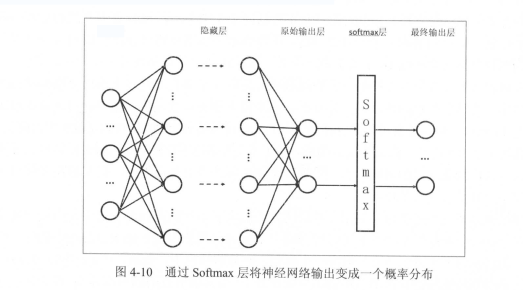

# 损失函数定义

神经网络模型的效果以及优化的目标是通过损失函数（loss function）来定义的 。

## 经典损失函数

分类问题和回归问题是监督学习的两大种类。

分类问题希望解决的是将不同的样本分到事先定义好的类别中。判断一个零件是否合格的问题就是一个二 分类问题。

交叉熵：刻画了两个概率分布之间的距离 , 它是分类问题中使用比较广的一种损失函数。

交叉熵是一个信息论中的概念,它原本是用来估算平均编码长度的。给定两个概率分布 p 和 q , 通过 q 来表示 p 的交叉煽为 :
$$
H(p,q)=-\sum_{x}p(x)log q(x)
$$
注意交叉熵：刻画的是两个概率分布之间的距离 , 然而神经网络的输出却不一定是一个概率分布。概率分布刻画了不同事件发生的概率。当事件总数有限的情况下 ,概率分布函数 p(X = x) 满足 :
$$
\forall x  \quad p(X=x)\epsilon[0,1]且\sum_{x}p(X=x)=1
$$
也就是说，任意事件发生的概率都在 0 和 1 之间，且总有某 一个事件发生 ( 概率的和为 1 )。

对于多分类问题，Softmax是一个非常常用的方法。Softmax 回归本身可以作为一个学习算法来优化分类结果，但在 TensorFlow中， Softmax回归的参数被去掉了，它只是一 层额外的处理层,将神经网络的输出变成一个概率分布。下图展示了加上了 Softmax 回归的神经网络结构图 。

假设原始的神经网络输出为 y1,y2...,那么经过 Softmax 回归处理之后的输出为 :
$$
softmax(y)_i=y_j'=\frac{e^{yj}}{\sum_{j=1}^{n}{e^{yj}}}
$$
从以上公式中可以看出，原始神经网络的输出被用作置信度来生成新的输出，而新的输出满足概率分布的所有要求。这个新的输出可以理解为经过神经网络的推导，一个样例为不同类别的概率分别是多大。这样就把神经网络的输出也变成了 一个概率分布，从而可以通过交叉熵来计算预测的概率分布和真实答案的概率分布之间的距离了。

从交叉熵的公式中可以看到交叉熵不是对称的 （H(p, q)不等于H(q,p )） ,它刻画的是通过概率分布 q 来表达概率分布 p 的困难程度。因为正确答案是希望得到的结果，所以当交叉熵作为神经网络的损失函数时， p 代表的是正确答案， q 代表的是预测值。交叉熵刻画的是两个概率分布的距离，也就是说交叉熵值越小，两个概率分布越接近。