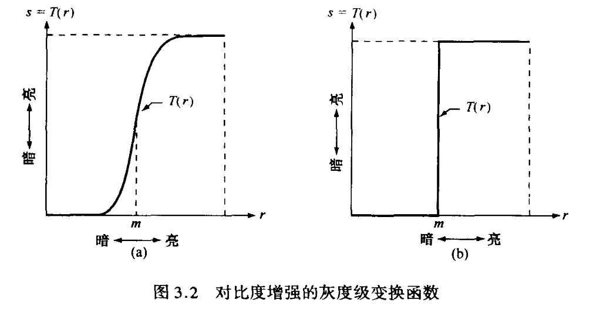
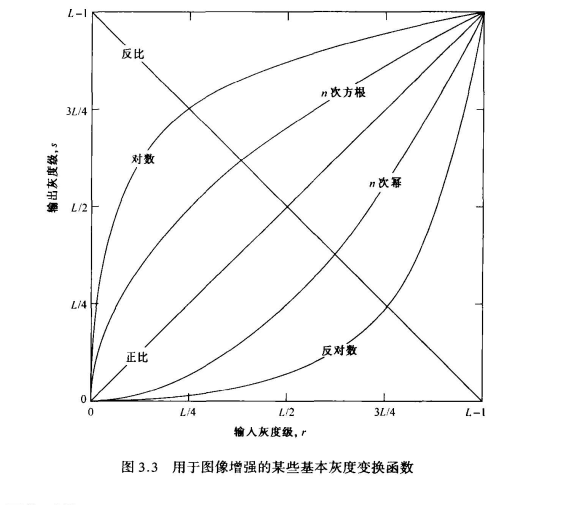
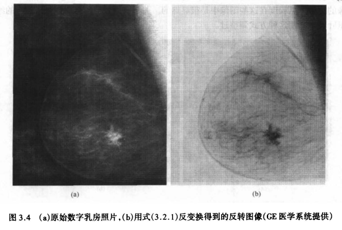

[TOC]

# 空间域图像增强

图像增强的首要目标是处理图像，使其比原始图像更适合与特定的应用。显示那些重要的细节，或突出一幅图像感兴趣的特征。

图像增强的方法分为两个大类：空间域方法和频域方法。空间域"一词是指图像平面自身，这类方法是以对图像的像素直接处理为基础的。"频域"处理技术是以修改图像的傅氏变换为基础的。

## 背景知识

“空间域增强”是指增强构成图像的像素。空间域方法是直接对这些像素操作的过程。空间域处理可由下式定义：
$$
g(x,y)=T[f(x,y)]\quad(3.1.1)
$$
其中f（x，y）是输入图像，g（x，y）是处理后的图像，T是对 f 的一种操作，其定义在（x，y）的领域。另外，T 能对输入图像集进行操作，例如，为减少噪音而对 K 幅图像进行逐像素的求和操作。

T 操作最简单的形式是领域为1x1的尺度（即单个像素）。在这种情况下，g仅仅依赖于 f 在（x，y）点的值，T操作称为灰度级变换函数（也叫强度映射），形式为：
$$
s =  T(r)
$$
这里，令 r 和 s 是所定义的变量，分别是f（x，y）和g（x，y）在任意点（x，y）的灰度级。下图3.2展示通过 T 操作提高原始图像的对比度，进行变换时，在原始图像中，灰度级低于 m 时变暗，而灰度级在 m 以上时变亮。图（a）中 s 型变成图（b）中阶梯型。

## 部分基本灰度变换

图3.3显示了图像增强常用的三个基本类型函数：线性的（正比和反比）、对数的（对数和反对数变换）、幂次的（n次幂和n次方根变换）。

### 图像反转

灰度级范围为[0,L-1]的图像反转可由图3.3的反比变换获得，表达式为：
$$
s = L-1-r
$$

用这种方式倒转图像的强度（灰度值）产生图像反转的对等图像 。 这种处理尤其适用于增强嵌入于图像暗色区域的白色或灰色细节，特别是当黑色面积占主导地位时 。一个例子示于图 3 .4，原始图像为 一 乳房的数字 X 照片，可看到有一小块病变 。尽管事实上两幅图在视觉内容上都一样，但注意，在这种特殊情况下，分析乳房组织结构时反转图像要容易得多。

### 对数变换

对数变换的一般表达式为：
$$
s = c \quad  log(1+r)
$$
其中 c 是一个常数，并假设 r ≥ 0 。