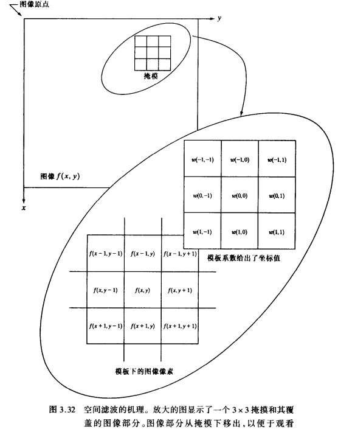

[TOC]

# 图像增强——空间滤波

空间滤波的机理，就是在待处理图像中逐点地移动掩模。在没一点（x，y）处，滤波器在该点的响应通过事先定义的关系来计算。

对于线性空间滤波，其响应由滤波器系数与滤波掩模扫过区域的对应像素值的乘积之和给出。图3.32所示为3x3的掩模，在图像中的点（x，y）处，用该掩模线性滤波的响应R为：

## 平滑空间滤波器

平滑滤波器用于模糊处理和减小噪声。模糊处理经常用于预处理，例如，在提取大的目标之前去除图像中一些琐碎的细节、桥接直线或曲线的缝隙。通过线性滤波器和非线性滤波器的模糊处理可以减小噪声。

### 平滑线性滤波器

平滑线性空间滤波器的输出（响应）是包含在滤波掩模领域内像素的简单平均值。因此，这些滤波器也称为均值滤波器。

### 统计排序滤波器

## 锐化空间滤波器

### 基于二阶微分的图像增强——拉普拉斯算子

### 基于一阶微分的图像增强——梯度法

## 混合空间增强法

